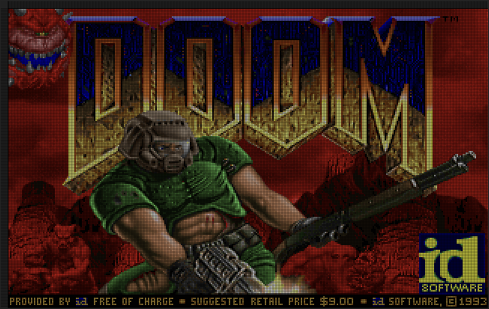
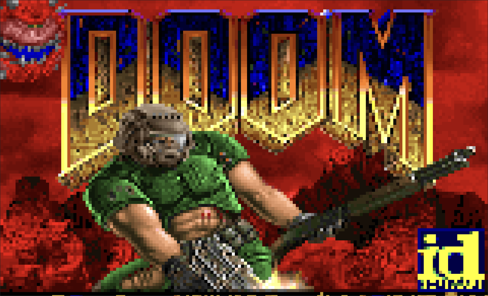

# Deephaven Doom

Based on the Vite TypeScript template, and then inspired by [this blog post](https://healeycodes.com/doom-rendered-via-checkboxes) about rendering Doom with checkboxes. Renders Doom in the `@deephaven/grid` component and AG Grid component. Click into the Grid and then play doom!

Run `npm run dev` to run this, then navigate to http://localhost:5173 in your browser. To view the AG Grid example, go to http://localhost:5173/ag-grid in your browser.

Note: This is simply done as a fun exercise, to benchmark the performance of different grid solutions. We do not recommend using a grid to play Doom. Now rip and tear!

# Controls

**Arrow keys:** Walk around, navigate menu
**Enter:** Select option in menu
**Ctrl:** Shoot
**Spacebar:** Open doors
**Alt+Arrow Keys:** Strafe
**Escape:** Pause game

## @deephaven/grid

Navigate to http://localhost:5173 to play Doom using the [@deephaven/grid](https://deephaven.io/grid/docs/) component. It is a canvas based grid solution, optimized for performance. With this solution, Doom is very playable, and you can do normal grid operations such as resizing/reordering columns/rows and cell selection. You can find the source for it in the [Deephaven web-client-ui repository](https://github.com/deephaven/web-client-ui/blob/main/packages/grid/README.md).

## AG Grid

Navigate to http://localhost:5173/ag-grid to play Doom using the [AG Grid](https://www.ag-grid.com/) component. AG Grid is a popular high-performance DOM based grid solution. With this solution, Doom is hardly playable and very choppy, even at half the resolution of the @deephaven/grid solution. You can resize/reorder columns, but it is very slow.

